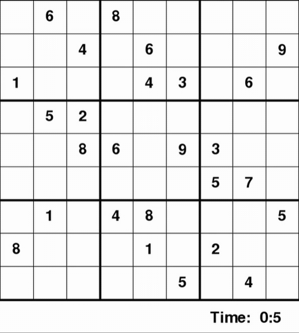
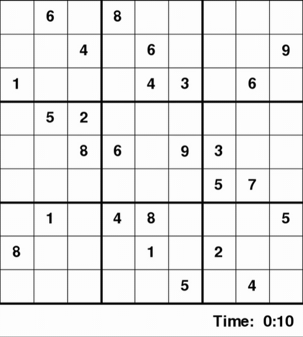

# Sudoku-Solver

Visualize the process of solving a sudoku grid using backtracking algorithm vs optimized version of a backtracking algorithm.


### Prerequiste
To run the GUI version, you must have pygame in your computer.
```pip install pygame``` to install

### How to use:
```python sudoku.py``` for a Non-GUI version

```python sudoku-GUI.py {a,b}``` for a GUI version, press "space bar" to trigger the algorithm to run 

args: a to run the solver using optimized algorithm, b for regular backtracking algorithm.


### To modify board:
You can change the board set up by modifying 2D array in my code.

### Algorithm used:
Backtracking: https://en.wikipedia.org/wiki/Backtracking

Backtracking optimized by using lookahead with MRV heuristic value : https://en.wikipedia.org/wiki/Look-ahead_(backtracking)
>>> Minimum remaining values (MRV): choose the variable with the fewest possible values. Least-constraining value heuristic: choose a value that rules out the smallest number of values in variables connected to the current variable by constraints.

### Demo 
##### Classic Back Tracking   ======================= Optimized 

  #######    


 


